<div align="center">

<!-- Hero Banner -->
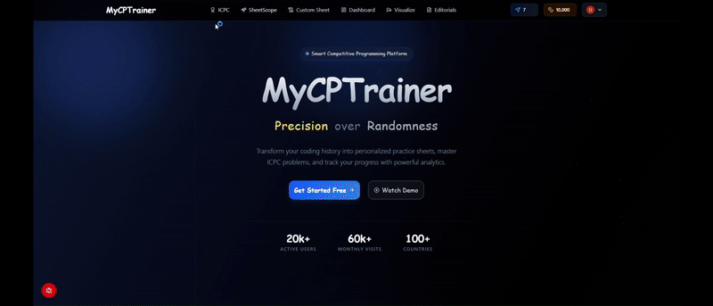

# 🏆 MyCPTrainer

### **The Ultimate Competitive Programming Companion**

*Master Competitive Programming with AI-Powered Analytics, ICPC Practice, and Smart Training Tools*

<p>
  <a href="https://mycptrainer.com">🌐 Live Demo</a> •
  <a href="#-features">✨ Features</a> •
  <a href="#-architecture">🏗️ Architecture</a> •
  <a href="#-tech-stack">💻 Tech Stack</a> •
  <a href="#-engineering-highlights">🧠 Engineering</a>
</p>

<!-- Tech Badges -->
<p>
  
  
  
  
</p>

<p>
  
  
  
  
</p>

<!-- Status Badges -->
<p>
  
  
  
  
</p>

</div>

---

## 📋 Table of Contents

- [Problem Statement](#-problem-statement)
- [Features](#-features)
- [Feature Demos](#-feature-demos)
- [Architecture](#-architecture)
- [Tech Stack](#-tech-stack)
- [Engineering Highlights](#-engineering-highlights)
- [System Flow Diagrams](#-system-flow-diagrams)
- [Performance Metrics](#-performance-metrics)
- [Security & Scalability](#-security--scalability)
- [Roadmap](#-roadmap)
- [Team](#-team)
- [Contact](#-contact)

---

## 🎯 Problem Statement

Competitive programmers face significant challenges in their learning journey:

| Challenge | Impact |
|-----------|--------|
| 📊 **Fragmented Progress Tracking** | Hard to understand growth across platforms |
| 🎯 **Random Problem Selection** | Inefficient practice without structured approach |
| 📈 **No Personalized Analytics** | Missing insights about strengths and weaknesses |
| 🧠 **Limited Learning Resources** | Lack of quality editorials and explanations |
| 🏆 **ICPC Preparation Gap** | No dedicated platform for ICPC-style training |

**MyCPTrainer solves all of this with an integrated, AI-powered platform.**

---

## ✨ Features

### 🔥 Core Features

<table>
<tr>
<td width="50%">

#### 📊 **Smart Dashboard**
Real-time analytics with 18+ performance metrics including:
- Rating progression tracking
- Problem-solving patterns
- Skill value calculations
- Topic-wise strength analysis
- Recent momentum scoring

</td>
<td width="50%">

#### 🎄 **Codeforces Wrapped**
Spotify Wrapped-style annual review featuring:
- Year-in-review statistics
- Personalized problem-solving insights
- Contest performance analysis
- Shareable summary cards
- Brutalist-chaos aesthetic UI

</td>
</tr>
<tr>
<td width="50%">

#### 🧮 **Algorithm Visualizer**
Interactive visualizations for:
- Binary Trees & BST operations
- Graph algorithms (BFS, DFS, Dijkstra)
- Sorting algorithms comparison
- Binary Search visualization
- Step-by-step execution

</td>
<td width="50%">

#### 📝 **ICPC Problem Bank**
Curated ICPC practice system with:
- Past contest problems collection
- Integrated online judge
- Custom test case support
- Instant verdict & feedback
- Checker-based validation

</td>
</tr>
<tr>
<td width="50%">

#### 🎯 **Personalized Sheets**
Smart problem curation featuring:
- Rating-based difficulty adjustment
- Topic-focused training sets
- Progress tracking per sheet
- Custom sheet creation
- Shareable problem lists

</td>
<td width="50%">

#### 🤖 **AI-Powered Editorials**
Intelligent problem analysis with:
- Step-by-step explanations
- Approach breakdowns
- Complexity analysis
- Alternative solutions
- Hint system

</td>
</tr>
</table>

### 🎁 Additional Features

| Feature | Description |
|---------|-------------|
| 💰 **Coin System** | Gamification layer encouraging consistent practice |
| 🔄 **Profile Comparison** | Compare metrics with other competitive programmers |
| 🤖 **Telegram Bot** | Daily problem delivery and streak tracking |
| 🔐 **Dual Authentication** | Google OAuth + Codeforces verification |
| 📱 **PWA Support** | Installable progressive web app |
| 🌙 **Dark Mode** | Eye-friendly dark theme throughout |

---

## 🎬 Feature Demos

### 📸 Screenshots

<details>
<summary><b>🏠 Landing Page</b> (Click to expand)</summary>
<br>
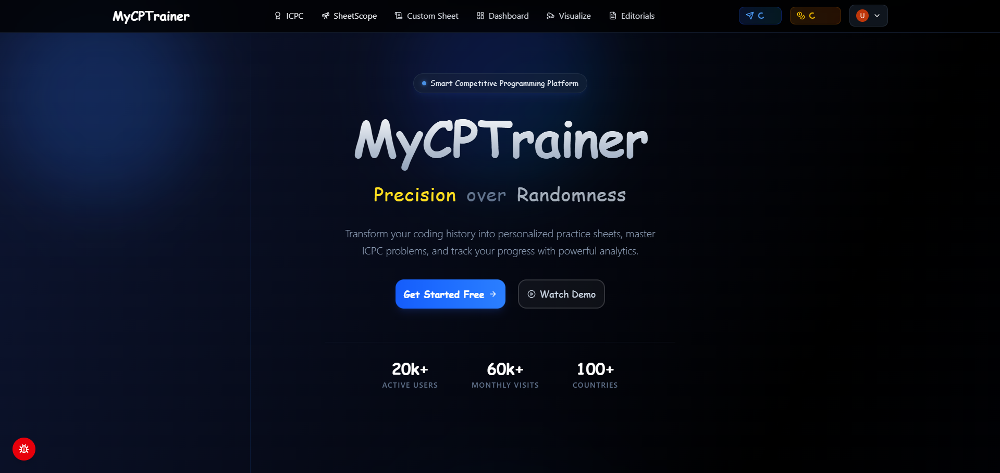
<p><i>Modern, responsive landing page with feature highlights</i></p>
</details>

<details>
<summary><b>📊 Analytics Dashboard</b> (Click to expand)</summary>
<br>
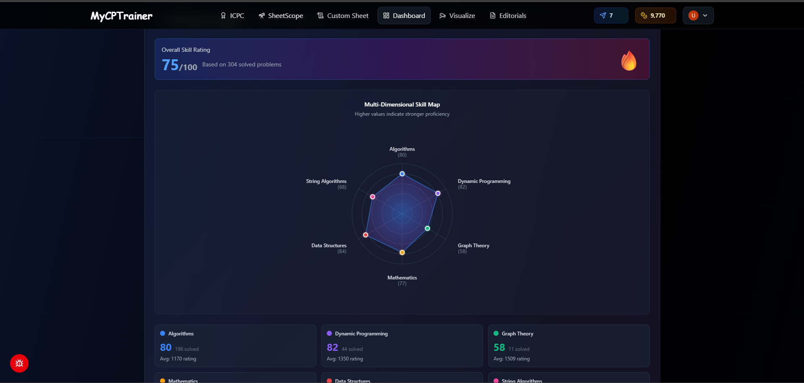
<p><i>Comprehensive analytics with 18+ performance metrics</i></p>
</details>

<details>
<summary><b>🤖 AI-Powered Editorials</b> (Click to expand)</summary>
<br>
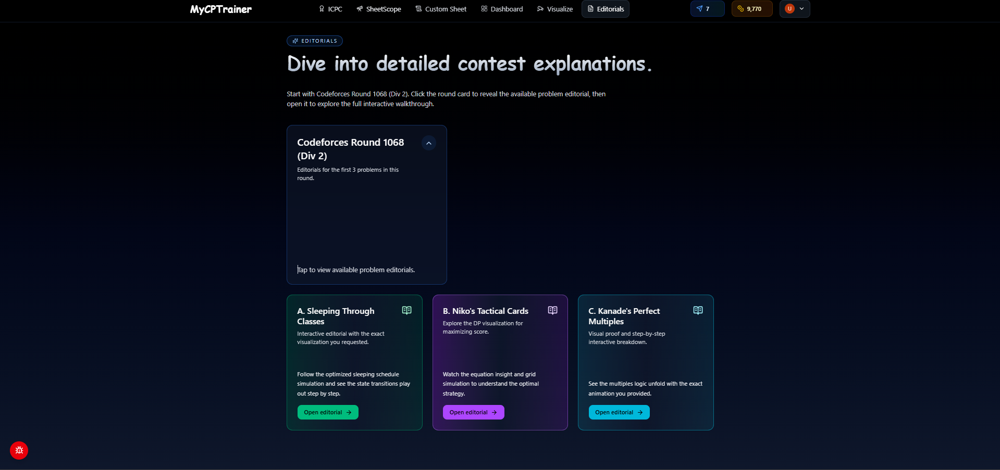
<p><i>Step-by-step problem explanations powered by Google Gemini</i></p>
</details>

<details>
<summary><b>📝 ICPC Problem Bank</b> (Click to expand)</summary>
<br>
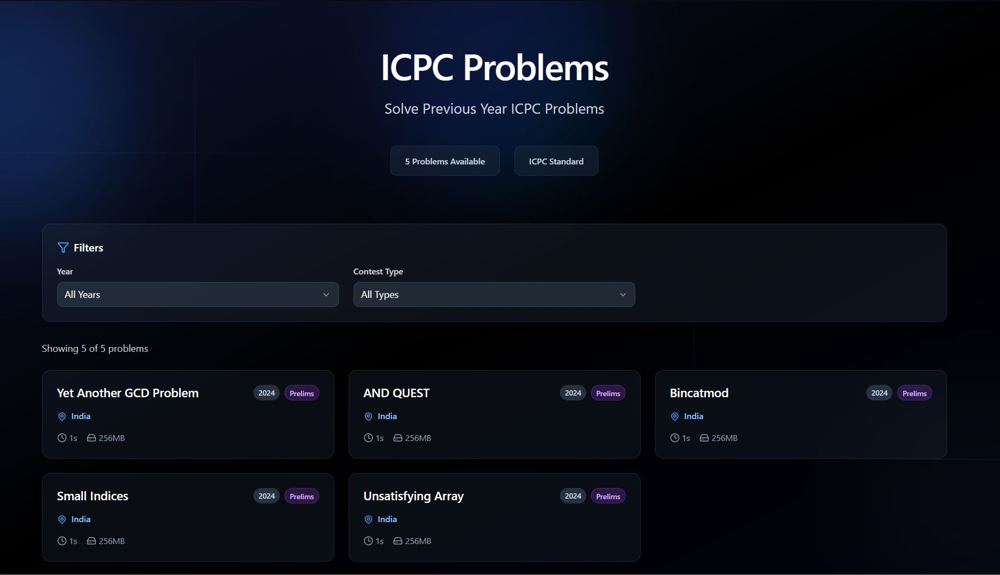
<p><i>Curated collection of ICPC-style competitive programming problems</i></p>
</details>

<details>
<summary><b>💻 Online Judge & Compiler</b> (Click to expand)</summary>
<br>
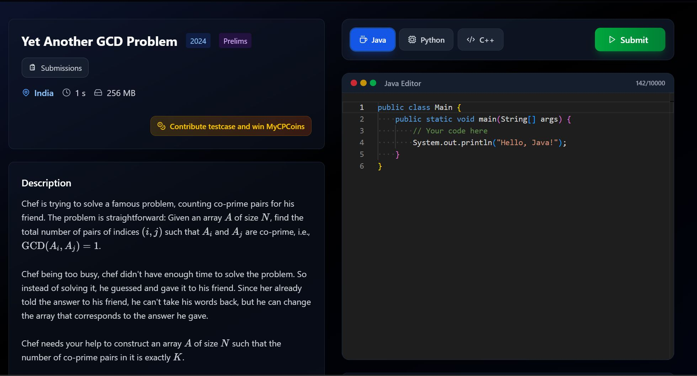
<p><i>Integrated code editor with real-time compilation and verdict</i></p>
</details>

<details>
<summary><b>📋 Problem Sheets</b> (Click to expand)</summary>
<br>
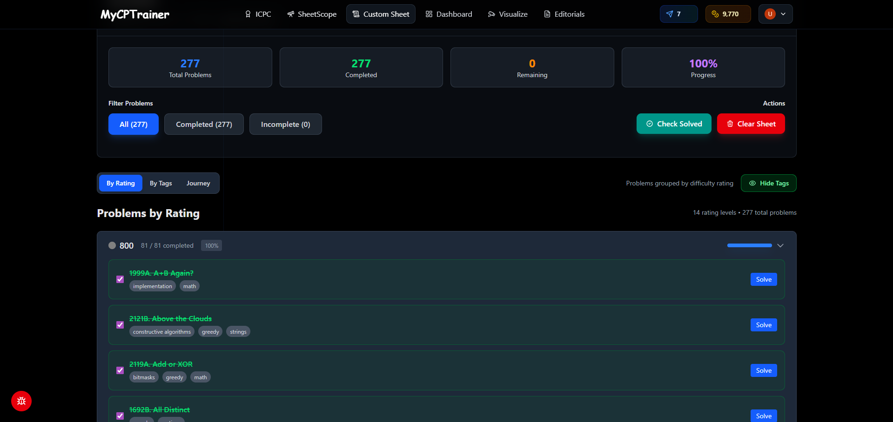
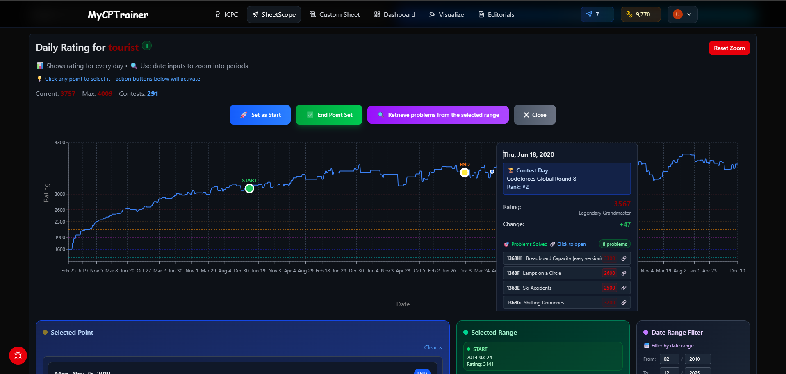
<p><i>Personalized problem tracking and progress management</i></p>
</details>

<details>
<summary><b>🎄 Codeforces Wrapped</b> (Click to expand)</summary>
<br>
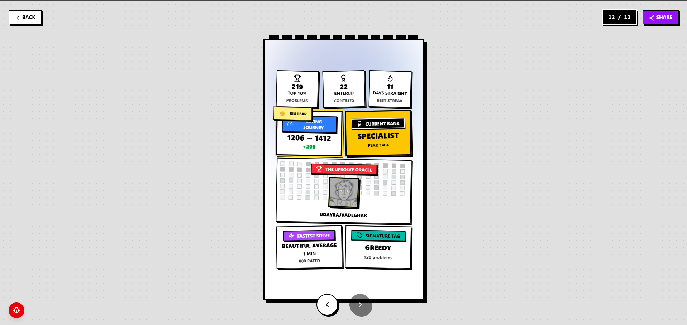
<p><i>Spotify Wrapped-style annual review with brutalist-chaos aesthetic</i></p>
</details>

<details>
<summary><b>🧮 Algorithm Visualizer - BFS</b> (Click to expand)</summary>
<br>
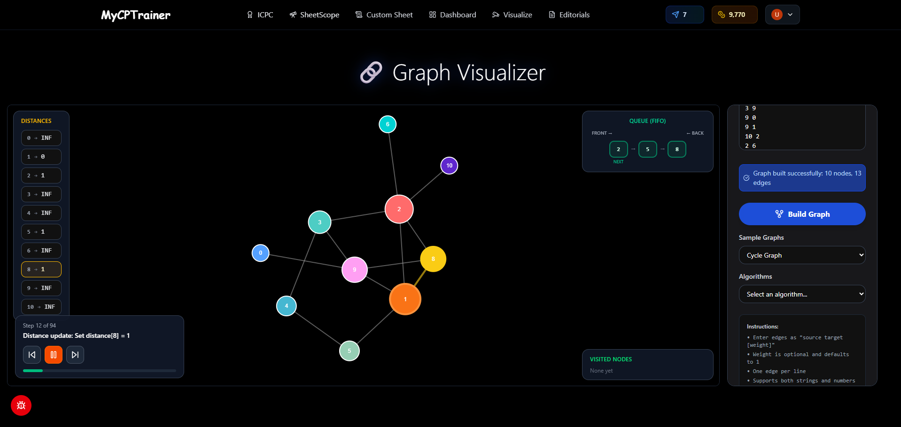
<p><i>Interactive BFS algorithm visualization with step-by-step execution</i></p>
</details>

### 🎥 Video Demos

<details>
<summary><b>📊 Dashboard Walkthrough</b> (Click to expand)</summary>
<br>
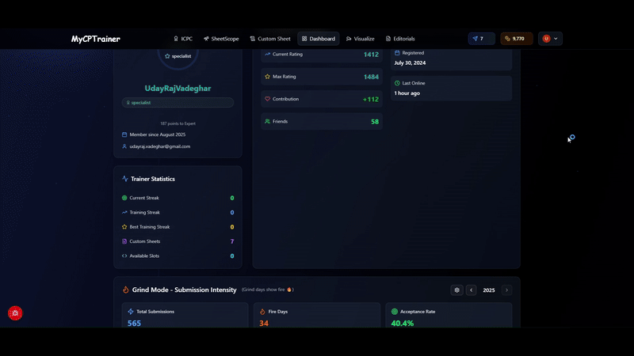
<p><i>Real-time analytics dashboard with comprehensive performance metrics</i></p>
</details>

<details>
<summary><b>🧮 Algorithm Visualizer Demo</b> (Click to expand)</summary>
<br>
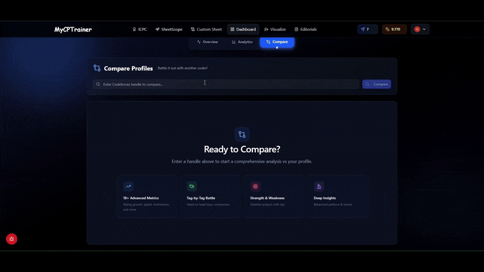
<p><i>Interactive algorithm visualization in action</i></p>
</details>

### 📈 User Metrics

<div align="center">
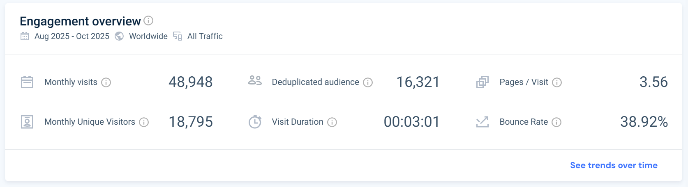
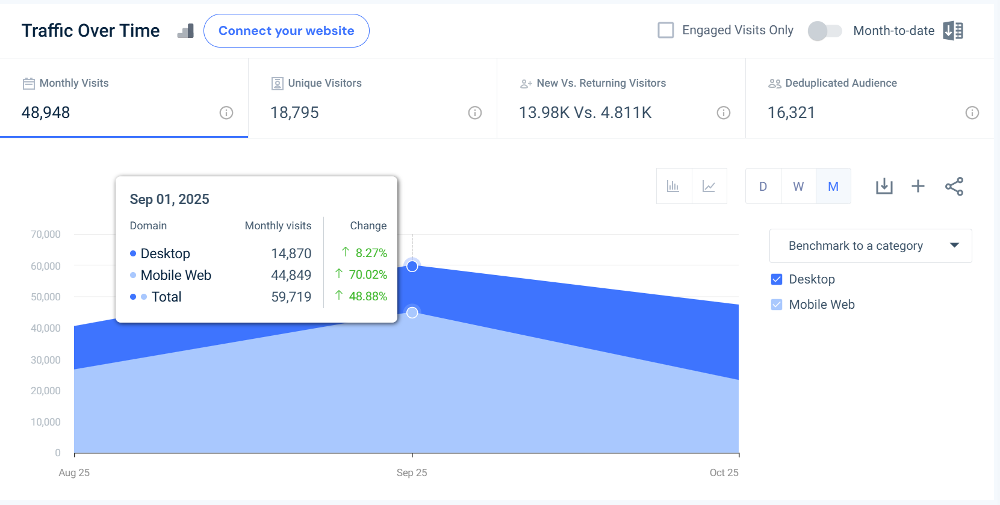
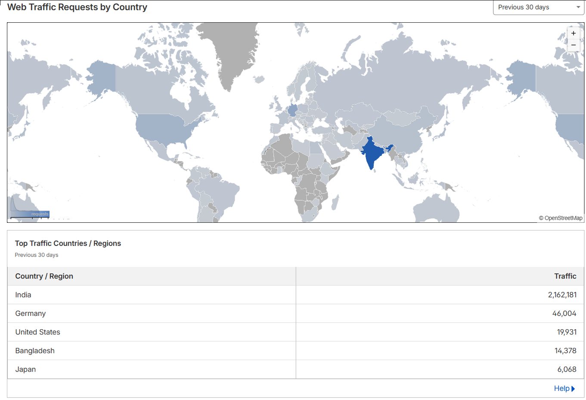

</div>
<p align="center"><i>Platform growth and user engagement metrics</i></p>

---

## 🏗️ Architecture

<div align="center">

</div>

### Architecture Overview

```
┌─────────────────────────────────────────────────────────────────────┐
│                         CLIENT LAYER                                 │
│  ┌─────────────┐  ┌─────────────┐  ┌─────────────┐                 │
│  │   Browser   │  │   Mobile    │  │  Telegram   │                 │
│  │   (React)   │  │    PWA      │  │     Bot     │                 │
│  └──────┬──────┘  └──────┬──────┘  └──────┬──────┘                 │
└─────────┼────────────────┼────────────────┼─────────────────────────┘
          │                │                │
          ▼                ▼                ▼
┌─────────────────────────────────────────────────────────────────────┐
│                      EDGE/CDN LAYER                                  │
│  ┌──────────────────────────────────────────────────────────────┐   │
│  │                    Cloudflare CDN                             │   │
│  │          (Caching, DDoS Protection, Edge Workers)             │   │
│  └──────────────────────────────────────────────────────────────┘   │
└─────────────────────────────────────────────────────────────────────┘
                              │
                              ▼
┌─────────────────────────────────────────────────────────────────────┐
│                     APPLICATION LAYER                                │
│  ┌──────────────────────────────────────────────────────────────┐   │
│  │                   Next.js 15 Application                      │   │
│  │  ┌────────────┐  ┌────────────┐  ┌────────────┐              │   │
│  │  │  React UI  │  │    SSR     │  │ API Routes │              │   │
│  │  │ Components │  │  Rendering │  │  Handlers  │              │   │
│  │  └────────────┘  └────────────┘  └────────────┘              │   │
│  └──────────────────────────────────────────────────────────────┘   │
└─────────────────────────────────────────────────────────────────────┘
          │                │                │
          ▼                ▼                ▼
┌─────────────────────────────────────────────────────────────────────┐
│                      SERVICE LAYER                                   │
│  ┌──────────┐  ┌──────────┐  ┌──────────┐  ┌──────────┐           │
│  │  Redis   │  │ Google   │  │  Sentry  │  │Cloudflare│           │
│  │ (Upstash)│  │  GenAI   │  │ Monitor  │  │ Workers  │           │
│  │  Cache   │  │ (Gemini) │  │  Errors  │  │  Crons   │           │
│  └──────────┘  └──────────┘  └──────────┘  └──────────┘           │
└─────────────────────────────────────────────────────────────────────┘
          │                │                │
          ▼                ▼                ▼
┌─────────────────────────────────────────────────────────────────────┐
│                    EXTERNAL APIs                                     │
│  ┌────────────────┐  ┌────────────────┐  ┌────────────────┐        │
│  │  Codeforces    │  │   Razorpay     │  │   Supabase     │        │
│  │     API        │  │   Payments     │  │     Auth       │        │
│  └────────────────┘  └────────────────┘  └────────────────┘        │
└─────────────────────────────────────────────────────────────────────┘
                              │
                              ▼
┌─────────────────────────────────────────────────────────────────────┐
│                       DATA LAYER                                     │
│  ┌──────────────────────────────────────────────────────────────┐   │
│  │                  PostgreSQL Database                          │   │
│  │              (Managed via Prisma ORM)                         │   │
│  │  ┌────────┐ ┌────────┐ ┌────────┐ ┌────────┐ ┌────────┐     │   │
│  │  │ Users  │ │ Sheets │ │ Orders │ │Problems│ │Submits │     │   │
│  │  └────────┘ └────────┘ └────────┘ └────────┘ └────────┘     │   │
│  └──────────────────────────────────────────────────────────────┘   │
└─────────────────────────────────────────────────────────────────────┘
```

### Data Flow

1. **User Request** → Cloudflare CDN (edge caching, DDoS protection)
2. **Cloudflare** → Next.js Application (cached/proxied requests)
3. **Next.js** → Supabase Auth (authentication & session management)
4. **Next.js** ↔ Redis (rate limiting, caching layer)
5. **Next.js** → PostgreSQL (database queries via Prisma)
6. **Next.js** → Codeforces API (user data, submissions)
7. **Next.js** → Google GenAI (AI-powered features)
8. **Next.js** → Razorpay (payment processing)
9. **Next.js** → Sentry (error tracking & monitoring)
10. **Cloudflare Workers** → Scheduled cron jobs (data sync)

---

## 💻 Tech Stack

### Frontend

<table>
<tr>
<td align="center" width="100">

<br><b>Next.js 15</b>
<br><sub>App Router, SSR</sub>
</td>
<td align="center" width="100">

<br><b>React 19</b>
<br><sub>React Compiler</sub>
</td>
<td align="center" width="100">

<br><b>TypeScript 5</b>
<br><sub>Strict Mode</sub>
</td>
<td align="center" width="100">

<br><b>Tailwind 4</b>
<br><sub>CSS Framework</sub>
</td>
<td align="center" width="100">

<br><b>Framer Motion</b>
<br><sub>Animations</sub>
</td>
</tr>
</table>

### Backend & Database

<table>
<tr>
<td align="center" width="100">

<br><b>PostgreSQL</b>
<br><sub>Primary DB</sub>
</td>
<td align="center" width="100">

<br><b>Prisma</b>
<br><sub>ORM</sub>
</td>
<td align="center" width="100">

<br><b>Redis</b>
<br><sub>Upstash Cache</sub>
</td>
<td align="center" width="100">

<br><b>Supabase</b>
<br><sub>Auth Provider</sub>
</td>
<td align="center" width="100">

<br><b>Zod</b>
<br><sub>Validation</sub>
</td>
</tr>
</table>

### Infrastructure & Services

<table>
<tr>
<td align="center" width="100">

<br><b>Cloudflare</b>
<br><sub>CDN + Workers</sub>
</td>
<td align="center" width="100">

<br><b>Vercel</b>
<br><sub>Deployment</sub>
</td>
<td align="center" width="100">

<br><b>Google Cloud</b>
<br><sub>GenAI (Gemini)</sub>
</td>
<td align="center" width="100">

<br><b>Sentry</b>
<br><sub>Error Tracking</sub>
</td>
<td align="center" width="100">

<br><b>Razorpay</b>
<br><sub>Payments</sub>
</td>
</tr>
</table>

### Libraries & Tools

| Category | Technologies |
|----------|--------------|
| **State Management** | Zustand, TanStack React Query |
| **UI Components** | Radix UI, Lucide Icons, Recharts |
| **Visualization** | D3.js, ReactFlow |
| **Code Editing** | Monaco Editor, Prism.js |
| **Math Rendering** | KaTeX |

---

## 🧠 Engineering Highlights

### System Design Decisions

<details>
<summary><b>⚡ Rate Limiting Architecture</b></summary>

```typescript
// Upstash Redis with sliding window algorithm
const ratelimit = new Ratelimit({
  redis: Redis.fromEnv(),
  limiter: Ratelimit.slidingWindow(100, "15m"),
  analytics: true,
});

// Per-endpoint rate limiting with user identification
export async function checkRateLimit(identifier: string) {
  const key = `ratelimit:${identifier}`;
  const { success, remaining, reset } = await ratelimit.limit(key);
  return { success, remaining, retryAfter: reset };
}
```

**Design Rationale:**
- Sliding window prevents burst attacks while allowing legitimate usage
- Redis-backed for distributed rate limiting across serverless functions
- Per-user and per-IP limiting for granular control

</details>

<details>
<summary><b>🗃️ Database Optimization</b></summary>

```sql
-- Strategic indexing for high-frequency queries
CREATE INDEX idx_users_handle ON Users(handle);
CREATE INDEX idx_users_email ON Users(email);
CREATE INDEX idx_submissions_problemid ON Submission(problemId);
CREATE INDEX idx_testcases_problem_index ON Testcase(problemId, index);
```

**Optimizations:**
- Composite indexes on frequently joined columns
- Connection pooling optimized for serverless (connection limit: 3)
- Prepared statements for repeated queries
- Query result caching with React Query

</details>

<details>
<summary><b>🔐 Authentication Flow</b></summary>

```
┌────────────────────────────────────────────────────────────────┐
│                  DUAL AUTHENTICATION SYSTEM                     │
├────────────────────────────────────────────────────────────────┤
│                                                                 │
│  ┌─────────────┐         ┌─────────────┐                       │
│  │   Google    │         │ Codeforces  │                       │
│  │   OAuth     │         │   OAuth     │                       │
│  └──────┬──────┘         └──────┬──────┘                       │
│         │                       │                               │
│         ▼                       ▼                               │
│  ┌──────────────────────────────────────────┐                  │
│  │           Supabase Auth                   │                  │
│  │    (PKCE Flow + Popup Authentication)    │                  │
│  └──────────────────────────────────────────┘                  │
│                        │                                        │
│                        ▼                                        │
│  ┌──────────────────────────────────────────┐                  │
│  │        Session Management                 │                  │
│  │   (Server-side + Cookie-based)           │                  │
│  └──────────────────────────────────────────┘                  │
│                                                                 │
└────────────────────────────────────────────────────────────────┘
```

**Features:**
- PKCE flow for enhanced security
- Popup-based OAuth for better UX
- Server-side session validation via middleware
- Secure cookie handling with httpOnly flags

</details>

<details>
<summary><b>📊 Caching Strategy</b></summary>

```
┌───────────────────────────────────────────────────────────────┐
│                    MULTI-LAYER CACHING                         │
├───────────────────────────────────────────────────────────────┤
│                                                                │
│   Layer 1: Cloudflare Edge (CDN)                              │
│   ├── Static assets: max-age=31536000 (1 year)               │
│   ├── API responses: max-age=300 (5 minutes)                 │
│   └── Pages: max-age=604800 (7 days)                         │
│                                                                │
│   Layer 2: Redis (Upstash)                                    │
│   ├── Rate limit counters: TTL 60s                           │
│   ├── API response cache: TTL 300s                           │
│   └── Session data: TTL 86400s                               │
│                                                                │
│   Layer 3: React Query (Client)                               │
│   ├── staleTime: 30 seconds                                  │
│   ├── refetchOnWindowFocus: intelligent                      │
│   └── Cache persistence across navigation                     │
│                                                                │
└───────────────────────────────────────────────────────────────┘
```

</details>

### Performance Optimizations

| Optimization | Implementation | Impact |
|--------------|----------------|--------|
| **React Compiler** | Enabled in Next.js 15 | Auto-memoization |
| **Code Splitting** | Per-route lazy loading | Reduced initial bundle |
| **Image Optimization** | Next.js Image component | 40% faster loads |
| **Bundle Analysis** | Webpack bundle analyzer | Identified bloat |
| **SSR + ISR** | Server rendering + revalidation | SEO + freshness |

---

## 🔄 System Flow Diagrams

### Authentication Flow
<div align="center">

</div>
<p align="center"><i>Complete authentication flow with Google OAuth and Codeforces verification</i></p>

### Data Flow Architecture
<div align="center">
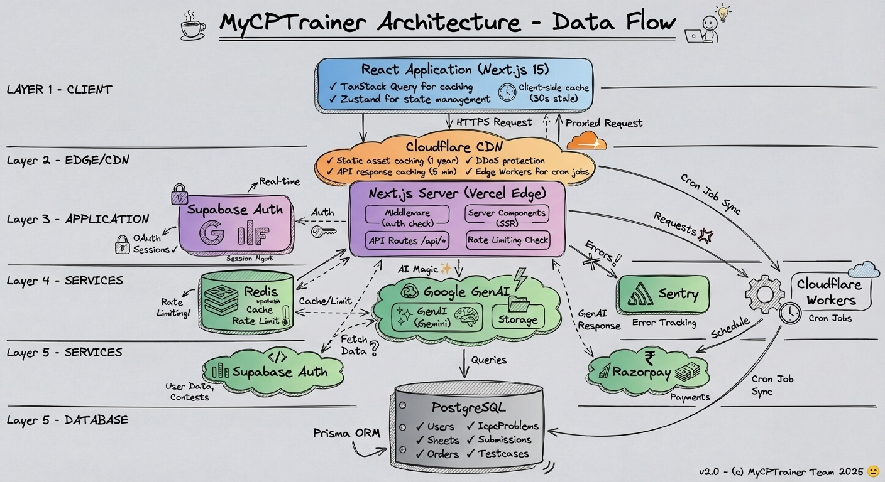
</div>
<p align="center"><i>Data flow between services, caching layers, and external APIs</i></p>

### User Journey Flow
<div align="center">

</div>
<p align="center"><i>Complete user journey from signup to feature utilization</i></p>

---

## 📊 Performance Metrics

| Metric | Value | Target |
|--------|-------|--------|
| ⚡ **Lighthouse Performance** | 95+ | 90+ |
| 🚀 **Time to First Byte** | <200ms | <300ms |
| 📦 **First Contentful Paint** | <1.2s | <1.5s |
| 🎯 **Largest Contentful Paint** | <2.5s | <3.0s |
| 📱 **Mobile Score** | 90+ | 85+ |
| 🔍 **SEO Score** | 100 | 95+ |

---

## 🔒 Security & Scalability

### Security Measures

- ✅ **Rate Limiting** - Upstash Redis sliding window algorithm
- ✅ **Input Validation** - Zod schema validation on all inputs
- ✅ **CORS Configuration** - Strict origin policies
- ✅ **HTTPS Only** - SSL/TLS enforcement via Cloudflare
- ✅ **Environment Isolation** - Secrets in environment variables
- ✅ **SQL Injection Prevention** - Prisma parameterized queries
- ✅ **XSS Protection** - React's built-in escaping + CSP headers
- ✅ **Authentication** - PKCE OAuth flow with Supabase

### Scalability Architecture

- 🚀 **Serverless First** - Vercel edge functions
- 🌍 **Global CDN** - Cloudflare edge caching
- 📊 **Connection Pooling** - Optimized for serverless
- 💾 **Multi-layer Caching** - CDN → Redis → Client
- 📈 **Horizontal Scaling** - Stateless application design
- 🔄 **Background Jobs** - Cloudflare Workers for cron

---

## 🗺️ Roadmap

### Completed ✅

- [x] Core Dashboard with Analytics
- [x] Codeforces Integration
- [x] Algorithm Visualizer (Tree, Graph, Sorting, Binary Search)
- [x] ICPC Problem Bank with Online Judge
- [x] Personalized Sheets System
- [x] AI-Powered Editorials
- [x] Codeforces Wrapped Feature
- [x] Payment Integration (Razorpay)
- [x] Telegram Bot
- [x] Coin & Gamification System

### In Progress 🚧

- [ ] LeetCode Integration
- [ ] CodeChef Integration
- [ ] Enhanced AI Recommendations

### Planned 📋

- [ ] Mobile Application (React Native)
- [ ] Browser Extension
- [ ] Contest Calendar Integration
- [ ] Virtual Contest Mode
- [ ] Team Collaboration Features
- [ ] Advanced Analytics Dashboard

---

## 👨‍💻 Team

<div align="center">

<table>
<tr>
<td align="center" width="200">

<br/><b>Uday Raj Vadeghar</b>
<br/><sub>Co-Founder & Full Stack Developer</sub>
<br/>
<a href="https://github.com/UdayRajVadeghar"></a>
<a href="https://linkedin.com/in/uday-raj-vadeghar"></a>
</td>
<td align="center" width="200">

<br/><b>Naivedyam Mishra</b>
<br/><sub>Co-Founder & CP Expert</sub>
<br/>
<a href="https://codeforces.com/profile/naivedyam"></a>
<a href="https://linkedin.com/in/naivedyam-mishra-20a23398"></a>
</td>
<td align="center" width="200">

<br/><b>Nithin Raj Chouhan</b>
<br/><sub>Founding Engineer</sub>
<br/>
<a href="https://github.com/nithin-raj-9100"></a>
<a href="https://www.linkedin.com/in/nithin-raj-32311222b"></a>
</td>
</tr>
</table>

</div>

---

## 📬 Contact

<div align="center">

Interested in this project? Want to discuss the technical implementation?

<p>
<a href="https://mycptrainer.com"></a>
<a href="https://t.me/mycptrainer_v1_bot"></a>
</p>

<p>
<a href="mailto:your-email@example.com"></a>
<a href="https://linkedin.com/in/uday-raj-vadeghar"></a>
</p>

</div>

---

<div align="center">

### ⭐ Star this repository if you find it impressive!

<p>


</p>

**© 2024-2025 MyCPTrainer. All rights reserved.**

*This is a showcase repository. The source code is proprietary and not available for public distribution.*

<sub>Made with ❤️ by the MyCPTrainer Team</sub>

</div>
